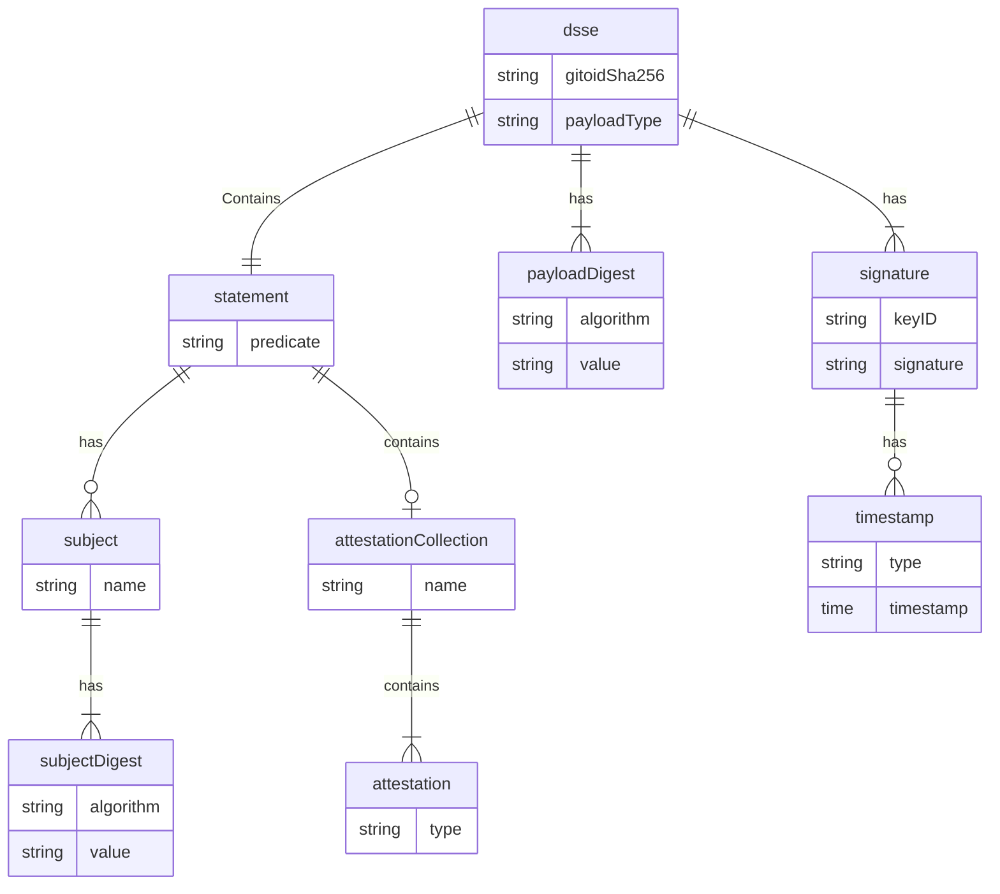

<p align="center">
  
</p>

# Archivista

Archivista is a graph and storage service for [in-toto](https://in-toto.io) attestations. Archivista enables the discovery
and retrieval of attestations for software artifacts.

## How Archivista Works

When an attestation is uploaded to Archivista it will store the entire attestation in a configured object store as well
as scrape some data from the attestation and store it in a queryable metadata store. This metadata is exposed through a
GraphQL API. This enables queries such as finding all attestations related to an artifact with a specified hash or
finding all attestations that recorded the use of a specific dependency.

Archivista uses Subjects on the [in-toto
Statement](https://github.com/in-toto/attestation/blob/main/spec/README.md#statement) as edges on this graph. Producers
of attestations (such as [Witness](https://github.com/testifysec/witness) can use these subjects as a way to expose
relationships between attestations.

For example when attesting that an artifact was compiled the compiled artifact may be a subject, as well as the git
commit hash the artifact was built from. This would allow traversing the graph by the commit hash to find other relevant
attestations such as those describing code reviews, testing, and scanning that happened on that git commit.

## Running Archivista

A public instance of Archivista is running [here](https://archivista.testifysec.io) for testing purposes. The data in this
instance is open to the world and there are currently no SLAs defined for this instance.

Archivista requires a MySQL database as well as a compatible file store. Compatible file stores include a local directory
or any S3 compatible store.

A docker compose file is included in the repository that will run a local instance of Archivista along with the necessary
services for it to operate. These include Minio and MySQL. Simply cloning the repo and running

```
docker compose up --build -d
```

is enough to get a local instance of Archivista up and running. Archivista will be listening at `http://localhost:8082` by
default with this docker compose file.

### Configuration

Archivista is configured through environment variables currently.

| Variable | Default Value | Description |
| -------- | ------------- | ----------- |
| ARCHIVISTA_LISTEN_ON | tcp://127.0.0.1:8082 | URL endpoint for Archivista to listen on |
| ARCHIVISTA_LOG_LEVEL | INFO | Log level. Options are DEBUG, INFO, WARN, ERROR |
| ARCHIVISTA_CORS_ALLOW_ORIGINS | | Comma separated list of origins to allow CORS requests from |
| ARCHIVISTA_SQL_STORE_CONNECTION_STRING | root:example@tcp(db)/testify | SQL store connection string |
| ARCHIVISTA_STORAGE_BACKEND | | Backend to use for attestation storage. Options are FILE, BLOB, or empty string for disabled. |
| ARCHIVISTA_FILE_SERVE_ON | | What address to serve files on. Only valid when using FILE storage backend. |
| ARCHIVISTA_FILE_DIR | /tmp/archivist/ | Directory to store and serve files. Only valid when using FILE storage backend. |
| ARCHIVISTA_BLOB_STORE_ENDPOINT | 127.0.0.1:9000 | URL endpoint for blob storage. Only valid when using BLOB storage backend. |
| ARCHIVISTA_BLOB_STORE_ACCESS_KEY_ID | | Blob store access key id. Only valid when using BLOB storage backend. |
| ARCHIVISTA_BLOB_STORE_SECRET_ACCESS_KEY_ID | | Blob store secret access key id. Only valid when using BLOB storage backend. |
| ARCHIVISTA_BLOB_STORE_USE_TLS | TRUE | Use TLS for BLOB storage backend. Only valid when using BLOB storage backend. |
| ARCHIVISTA_BLOB_STORE_BUCKET_NAME | | Bucket to use for storage.  Only valid when using BLOB storage backend. |
| ARCHIVISTA_ENABLE_GRAPHQL | TRUE | Enable GraphQL Endpoint |
| ARCHIVISTA_GRAPHQL_WEB_CLIENT_ENABLE | TRUE | Enable GraphiQL, the GraphQL web client |


## Using Archivista

Archivista exposes two HTTP endpoints to upload or download attestations:

```
POST /upload - Uploads an attestation to Archivista. The attestation is to be in the request's body
```

```
GET /download/:gitoid: - Downloads an attestation with provided gitoid from Archivista
```

Additionally Archivista exposes a GraphQL API. By default the GraphQL playground is enabled and available at root.

`archivistactl` is a CLI tool in this repository that is available to interact with an Archivista instance. `archivistctl`
is capable of uploading and downloading attestations as well as doing some basic queries such as finding all
attestations with a specified subject and retrieving all subjects for a specified attestation.

## Navigating the Graph

As previously mentioned, Archivista offers a GraphQL API that enables users to discover attestations. When Archivista ingests
an attestation some metadata will be stored into the SQL metadata store. This metadata is exposed through the GraphQL API.
Archivista uses [Relay connections](https://relay.dev/graphql/connections.htm) for querying and pagination.

Here is an entity relationship diagram of the metadata that is currently available.



## What's Next

We would like to expand the types of data Archivista can ingest as well as expand the metadata Archivista collected about
ingested data. If you have ideas or use cases for Archivista, feel free to [contact us](mailto:info@testifysec.io) or
create an issue!
